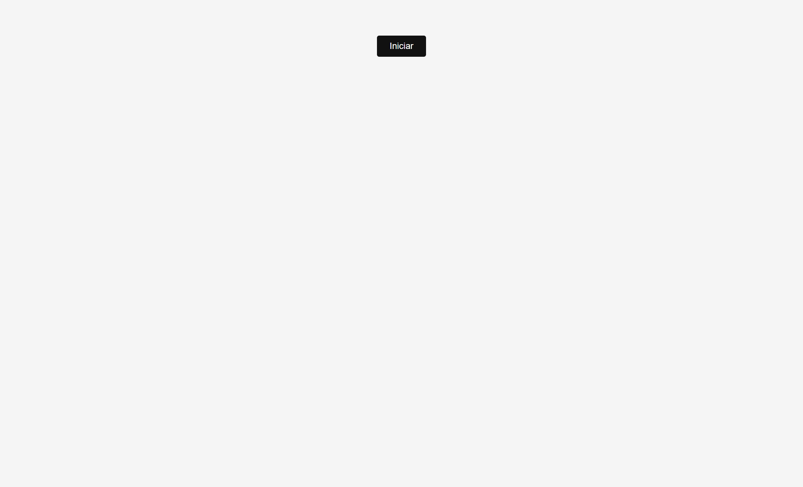
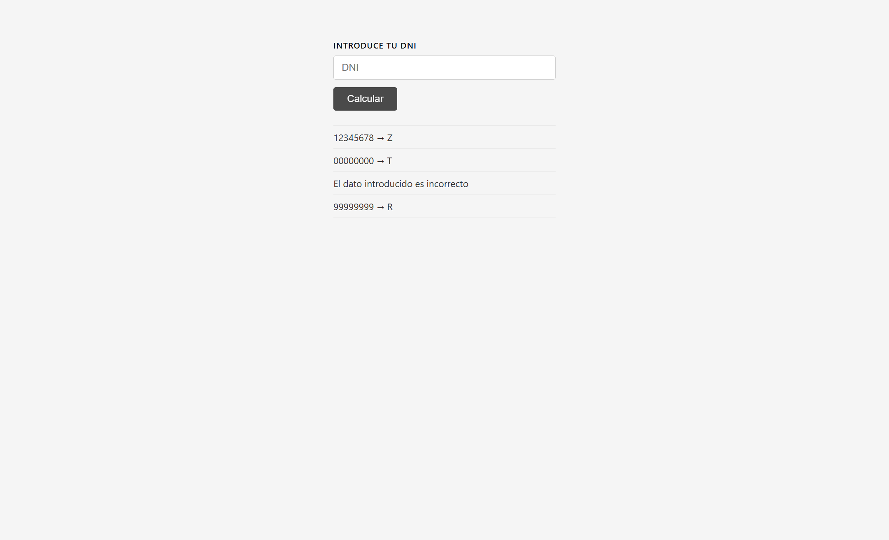

# DNI Checker

Aplicación web que calcula la letra del DNI español a partir de su número.

## Demo





## Cómo funciona

El algoritmo oficial para calcular la letra del DNI:

1. Se toma el número (entre 0 y 99.999.999)
2. Se calcula el **módulo 23** del número
3. El resultado (0–22) corresponde a una letra de la siguiente tabla:

| Resto | 0 | 1 | 2 | 3 | 4 | 5 | 6 | 7 | 8 | 9 | 10 | 11 |
|-------|---|---|---|---|---|---|---|---|---|---|----|----|
| Letra | T | R | W | A | G | M | Y | F | P | D | X  | B  |

| Resto | 12 | 13 | 14 | 15 | 16 | 17 | 18 | 19 | 20 | 21 | 22 |
|-------|----|----|----|----|----|----|----|----|----|----|-----|
| Letra | N  | J  | Z  | S  | Q  | V  | H  | L  | C  | K  | E  |

**Ejemplo:** `12345678 % 23 = 14` → letra **Z**

## Funcionalidades

- Botón **Iniciar** que arranca la aplicación
- Input con validación en tiempo real
- Cálculo con botón o pulsando **Enter**
- **Historial** acumulativo de todos los cálculos
- Mensajes de error para datos incorrectos
- Protección contra doble clic (botón deshabilitado 1 segundo tras calcular)

## Validaciones

| Entrada | Resultado |
|---------|-----------|
| Número entre 0 y 99999999 | Muestra `número → letra` |
| Número fuera de rango | `El dato introducido es incorrecto` |
| Texto no numérico | `El dato introducido es incorrecto` |

## Instalación

```bash
git clone https://github.com/iulian640/dni-checker.git
cd dni-checker
npm install
```

## Uso

Abre `index.html` con Live Server en VS Code o ejecuta:

```bash
npx vite
```

## Tests

```bash
npm test
```

### Resultado

```
 Test Files  3 passed (3)
      Tests  14 passed (14)
   Duration  866ms
```

### Cobertura de escenarios

| Escenario | Archivo |
|-----------|---------|
| DNI válido devuelve letra correcta | `service.test.js` |
| Número fuera de rango → false | `validate.test.js` |
| Dato no numérico → false | `validate.test.js` |
| Número negativo → false | `validate.test.js` |
| Botón iniciar desaparece | `controller.test.js` |
| Aparece el formulario | `controller.test.js` |
| Muestra letra correcta | `controller.test.js` |
| Muestra error dato inválido | `controller.test.js` |
| Muestra error fuera de rango | `controller.test.js` |
| Muestra error número negativo | `controller.test.js` |
| Vacía el input tras calcular | `controller.test.js` |
| Deshabilita botón tras calcular | `controller.test.js` |
| Acumula historial | `controller.test.js` |

## Tecnologías

- JavaScript (ES Modules)
- HTML5 / CSS3
- [Vitest](https://vitest.dev/) — tests unitarios
- [jsdom](https://github.com/jsdom/jsdom) — entorno DOM para tests

## Estructura

```
src/
├── app.js              # Punto de entrada
├── htmlcomponents.js   # Creación de elementos DOM
├── rendering.js        # Manipulación del DOM
├── events.js           # Event listeners
├── controller.js       # Lógica de flujo
├── service.js          # Cálculo de la letra
├── validation.js       # Validación de entrada
├── service.test.js     # Tests del checker
├── validate.test.js    # Tests de validación
└── controller.test.js  # Tests del controller
```

## Links

- [Repositorio](https://github.com/iulian640/dni-checker)
- [GitHub Pages](https://iulian640.github.io/dni-checker)
